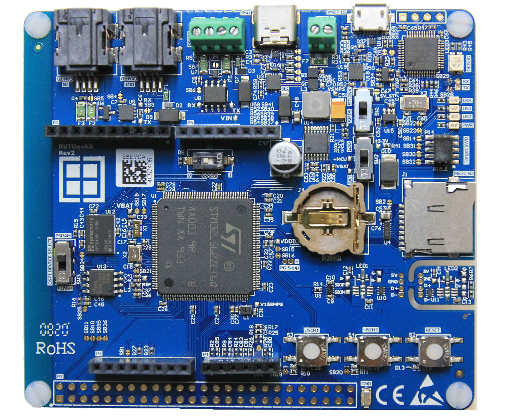

# RutDevKit-L5 [ RDK1 ]
The very first Rutronik Development Kit RutDevKit-STM32L5 also known as RDK1.

**With the RUTDevKit-STM32L5 created by Rutronik, hardware and firmware developers get a "one-stop" platform solution for their own  development. The Kit only uses products from Rutronik's portfolio.**

The developer kit based on an ultra-low-power microcontroller  (STM32L562ZET6Q) running at 110MHz, 512kB Flash memory and 256kB SRAM. A secure boot process and TrustZone-based system isolation ensures  protected applications development.

Thanks to various power  supply options (battery/SMPS) as well as the integrated CAN FD and RS485 interfaces, in combination with external PSRAM or NOR flash memory, the RUTDevKit is particularly suitable for the development of applications  such as wearables and sensors.

The embedded ST-LINK V2  debugger/programmer as well as the ArduinoTM expansion connectors for  additional boards offers augmented usability and flexibility like IoT  applications.

**Hardware-features:**

- STM32L562ZET6Q Cortex®-M33 512kB Flash

- APS6408L 64Mbit Octo-SPI PSRAM

- EN25QH128A 128Mbit Quad-SPI NOR Flash

- CAN FD with TLE9251VLE driver

- USB-C Power Delivery with TCPP01-M12 protection IC

- RS485 interface with ST3485EDBR driver

- Adam-Tech Micro SD Card Socket

- On-Board ST-LINK V2 debugger/programmer

- Arduino expansion connectors

- 4-Layer-Design

  
